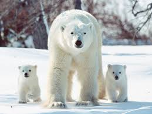
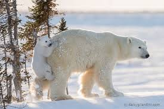

# Image Downloader

**Image Downloader** is a lightweight Python script that allows you to download images from the internet based on your search queries.

Additionally, to meet custom requirements, I have integrated the OpenAI SDK into this project, allowing you to use their API to filter images based on your specifications.

### Installation

```bash
git clone https://github.com/Goer17/image-downloader.git
```

```bash
pip install -e .
```

### Quick Start

```python
from image_downloader.layer.download import GoogleURLCrawler
from image_downloader.layer.llm import Critic

from image_downloader.pipeline import Pipeline

pipeline = Pipeline(
    crawlers=[GoogleURLCrawler()],
    layers=[
        Critic(
            base_url=base_url,
            api_key=api_key,
            model="gpt-4o",
            sys_prompt="Now, I will present you with some image-text pairs. If they correctly correspond, respond with \"YES\"; otherwise, reply with \"NO\".",
            filter_func=lambda resp: "YES" in resp
        )
    ]
)

urls = pipeline(
    query="polar bear",
    text="more than one polar bear",
    max_n=5,
    dowload_path="download"
)
```

> Successfully retrieved 5 images from Google.com, with 3 of them being filtered out.

<div align="center">
    
    
</div>
